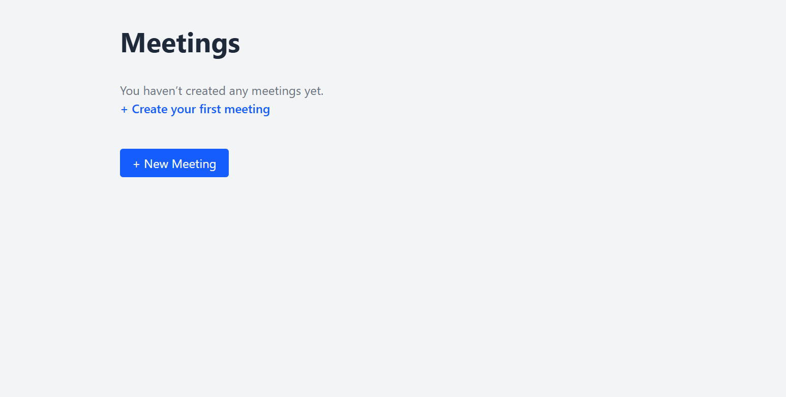
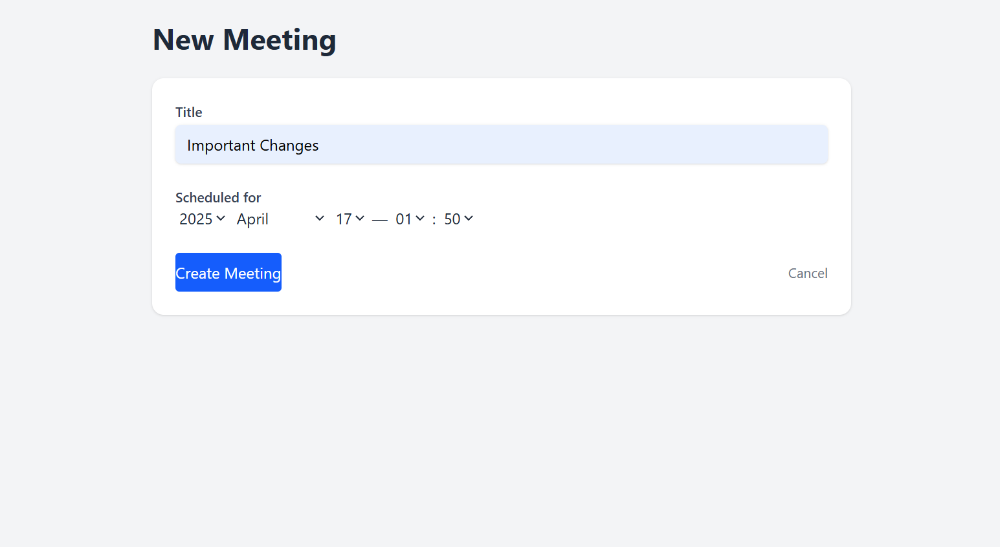
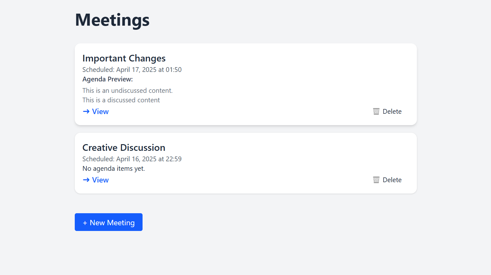
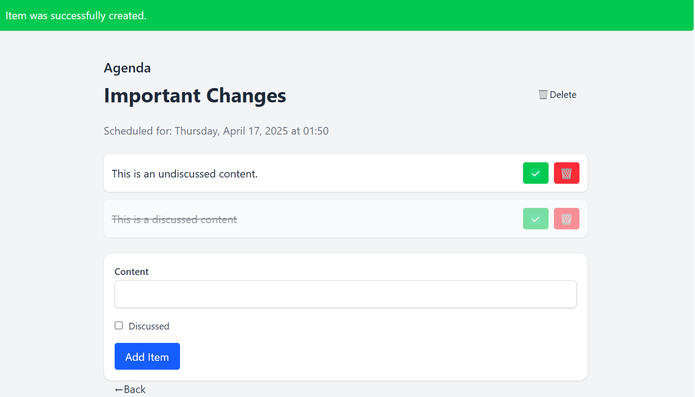

# Roundtable – Collaborative Meeting Agenda Tool

**Roundtable** is a small Ruby on Rails app I built to learn the language. 
# What It Does

Roundtable helps teams build meeting agendas together.

- Create meetings and assign a date/time.
- Add agenda items that need to be discussed.
- Mark items as discussed once they are covered.
- See everything update instantly with Turbo. 

It is a lightweight internal tool: no fluff, just exactly what is needed.

# Built With

- **Ruby on Rails 7**
- **Hotwire (Turbo)**
- **Tailwind CSS**
- **SQLite** (development Database)

# Screenshots
 

  


# Things I Focused On

- **Turbo Streams** for instant UI updates (no JS needed)
- **Clean RESTful controllers** with before_action and strong params
- **Tailwind CSS** for fast, cool UI with utility classes
- **Empty state UX** so the app always feels intentional
- **Graceful error handling** and flash messages

 # To Run Locally

```bash
git clone https://github.com/deniz14k/roundtable.git
cd roundtable

bundle install
yarn install #if you use tailwind with js bundler

ruby bin/rails db:create
ruby bin/rails db:migrate

ruby bin/dev
then open localhost in your browser. 

Thanks for checking this out!
